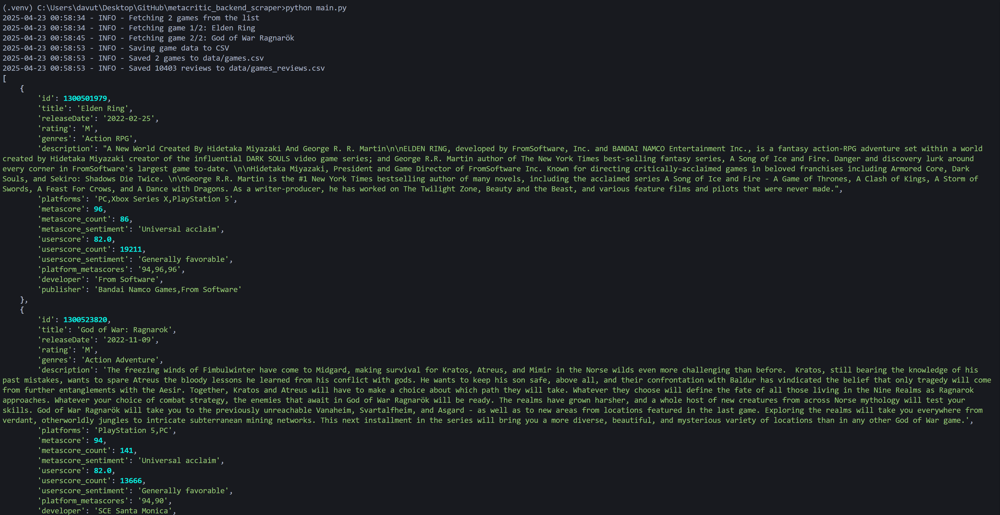
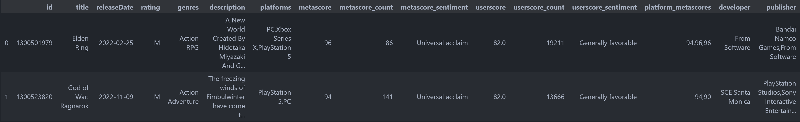
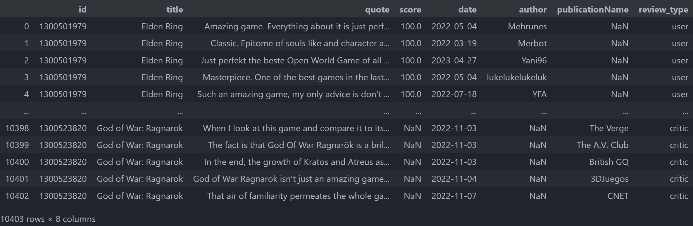

# 🎮🎬 Metacritic Backend Scraper

**Scrape high-quality data on games, movies, and TV shows straight from Metacritic’s backend. No frontend scraping. No fluff. Just clean, structured data.**

[](https://opensource.org/licenses/MIT)
[](https://www.python.org/)


---

## ✨ What is this?

The **Metacritic Backend Scraper** is a Python tool that taps into Metacritic’s **unofficial public backend API** to pull detailed, structured data on:

- 🕹️ **Games**
- 🎥 **Movies**
- 📺 **TV Shows**

It uses clean `requests` logic with retry mechanisms, structured `Pydantic` models for data validation, and saves everything to organized **CSV files**. Ideal for data science, machine learning, or just geeking out on media insights.

## 🚀 Features

- 🎯 Full metadata extraction (release date, ratings, genres, platforms, cast, director, etc.)
- 📝 Fetch critic and user reviews, complete with scores and quotes
- 📊 Supports single title, top-ranked titles, by year, or custom product lists
- 📋 Logs every action to both console and file
- 💾 Saves outputs to easy-to-use CSVs
- 🔐 Unicode-safe, URL-safe slugification
- 🧩 Built with modularity, extensibility, and readability in mind

### Installation

1. **Clone the repository**:
   ```bash
    git clone https://github.com/davutbayik/metacritic-backend-scraper.git
    cd metacritic-backend-scraper
   ```

2. **Create a virtual environment (Optional - Recommended)**:
   ```bash
   python -m venv .venv
   source .venv/bin/activate  # On Windows: .venv\Scripts\activate
   ```

3. **Install dependencies**:
   ```bash
   pip install -r requirements.txt
   ```

## 🧠 How It Works

The magic happens in `MetacriticScraper`, a flexible, object-oriented class with built-in support for:

- Session retries
- Clean URL slug generation
- Type-specific logic for parsing responses (games vs. movies vs. shows)
- Dynamic URL construction for reviews and top content

You can instantiate the scraper with just one line:

```python
from metacritic_scraper import MetacriticScraper

scraper = MetacriticScraper(product_type="games")
games, reviews = scraper.fetch_top_products(limit=10)
```

## 🛠 Usage Examples

### 1. Scrape top 20 movies from the last decade:
```python
scraper = MetacriticScraper(product_type="movies")
movies, reviews = scraper.fetch_top_products(limit=20, year_min=2015)
```

### 2. Scrape reviews for specific shows:
```python
scraper = MetacriticScraper(product_type="shows")
shows, reviews = scraper.fetch_product_list(["Breaking Bad", "Better Call Saul"])
```

### 3. Scrape games released in 2023:
```python
scraper = MetacriticScraper(product_type="games")
games, reviews = scraper.fetch_products_by_year(year=2023)
```

### 4. Scrape all movies (metacritic fetches all products which have at least 7 reviews)
```python
scraper = MetacriticScraper(product_type="movies")
movies, reviews = scraper.fetch_all_products()
```

Data is saved automatically to the `data/` directory as:

- `games.csv`
- `games_reviews.csv`

(Change `games` to `movies` or `shows` depending on type.)

## 📊 Datasets on Kaggle

Want to explore the scraped data directly without running the scraper?

Check out the published datasets on Kaggle using directly the MetacriticScraper class:

🔗 [Metacritic Games Dataset](https://www.kaggle.com/datasets/davutb/metacritic-games)  
🔗 [Metacritic Movies Dataset](https://www.kaggle.com/datasets/davutb/metacritic-movies)  
🔗 [Metacritic TV Shows Dataset](https://www.kaggle.com/datasets/davutb/metacritic-tv-shows)

Each dataset includes both the **metadata** and **reviews**, formatted and ready for analysis in CSV format.

*Don't forget to upvote if you find them useful! 👍*

## 🧾 Example Outputs







## 🎥 Example Demo


https://github.com/user-attachments/assets/ac84eae4-c03f-43d3-8761-7ed1ad6ae498


## ⚙️ Dependencies

- `requests`
- `pandas`
- `pydantic`
- `rich`
- `urllib3`

> All installable via `pip install -r requirements.txt`

## ⚠️ Disclaimer

This project uses an **unofficial Metacritic API** intended for educational purposes and internal use. Please use responsibly and be mindful of rate limits and Terms of Service.

## 📄 License

This project is licensed under the terms of the [MIT License](LICENSE).  
You are free to use, modify, and distribute this software as long as you include the original license.

## 📬 Contact

Made with ❤️ by [Davut Bayık](https://github.com/davutbayik) — feel free to reach out via GitHub for questions, feedback, or collaboration ideas.

---

⭐ If you found this project helpful, consider giving it a star!
